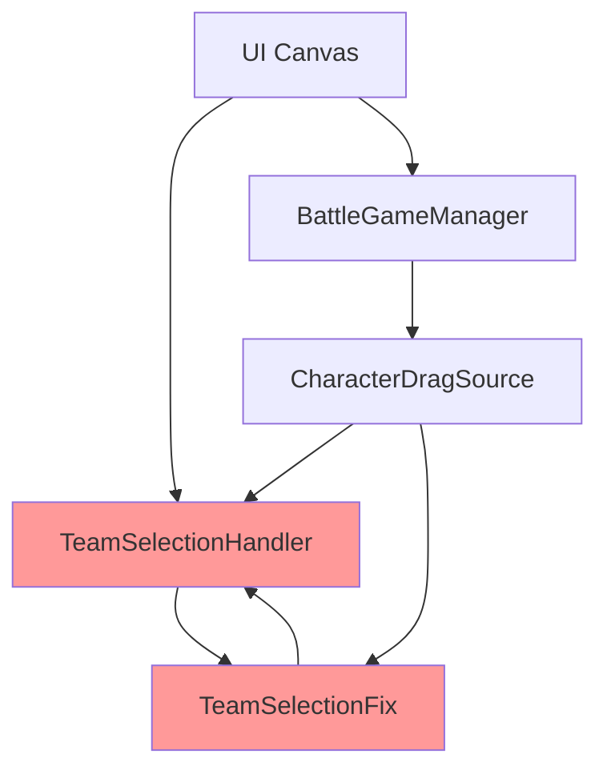
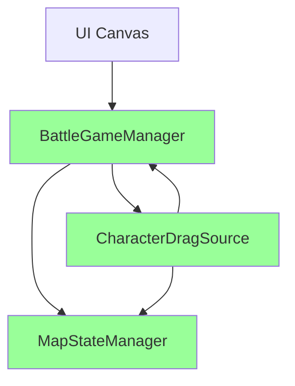

# 🏗️ Optimized Architecture - Sau tối ưu hóa UI System

## 📋 Overview

Document này mô tả kiến trúc hệ thống sau khi tối ưu hóa UI, loại bỏ xung đột và cải thiện maintainability.

## 🎯 Trước vs Sau tối ưu hóa

### **❌ Trước (Có vấn đề)**

**Vấn đề**: Xung đột giữa 2 hệ thống UI, dependencies phức tạp

### **✅ Sau (Đã tối ưu)**

**Kết quả**: Hệ thống thống nhất, dependencies rõ ràng

## 🏗️ Current Architecture

### **Core Components**

#### **1. BattleGameManager (Central Hub)**
```csharp
// File: Assets/Scripts/BattleGameManager.cs
public class BattleGameManager : MonoBehaviour
{
    [Header("UI References")]
    public Text statusText;
    public Button startButton, resetButton;
    
    [Header("Game State")]  
    public bool setupMode = true;
    public int selectedTeam = 1;
    public int selectedCharacterType = 0;
    
    // Core Methods (Refactored)
    void CreateCharacterButton()     // Split into 4 methods
    GameObject CreateButtonContainer()
    void AddCharacterPreview()
    void AddCharacterInfo()
    void SetupButtonInteraction()
}
```

**Responsibilities:**
- ✅ UI generation and management
- ✅ Team selection logic
- ✅ Character selection logic  
- ✅ Setup mode management
- ✅ Battle initialization

#### **2. CharacterDragSource (Drag & Drop)**
```csharp
// File: Assets/Scripts/CharacterDragSource.cs
public class CharacterDragSource : MonoBehaviour, 
    IBeginDragHandler, IDragHandler, IEndDragHandler
{
    public GameObject characterPrefab;
    public BattleGameManager gameManager;  // Single dependency
    
    // Simplified logic - no more TeamSelectionHandler conflicts
    public void OnEndDrag(PointerEventData eventData) {
        // Direct team access from gameManager.selectedTeam
        mapManager.AddCharacterInstance(
            characterPrefab.name, 
            groundPosition, 
            gameManager.selectedTeam,  // ← Simplified
            characterPrefab
        );
    }
}
```

**Responsibilities:**
- ✅ Drag & drop functionality
- ✅ 3D preview generation
- ✅ Direct integration with BattleGameManager
- ✅ MapStateManager communication

#### **3. MapStateManager (State Persistence)**
```csharp
// File: Assets/Scripts/MapStateManager.cs
public class MapStateManager : MonoBehaviour
{
    public static MapStateManager Instance;
    public List<CharacterInstance> characterInstances;
    
    public string AddCharacterInstance(string characterID, 
        Vector3 position, int team, GameObject prefab);
    public void ClearAllCharacters();
    public string SaveMapState();
}
```

**Responsibilities:**
- ✅ Character instance tracking
- ✅ Map state persistence
- ✅ Save/Load functionality
- ✅ Position validation

### **Removed Components (9 files)**

#### **❌ TeamSelectionHandler** - Caused UI conflicts
#### **❌ TeamSelectionFix** - Workaround for conflicts  
#### **❌ SimpleFix** - Another workaround
#### **❌ 6 Test/Debug Scripts** - No longer needed

```
DELETED FILES:
- TeamSelectionHandler.cs (.meta)
- TeamSelectionFix.cs (.meta)  
- SimpleFix.cs (.meta)
- DebugTeamSelection.cs (.meta)
- FinalTeamTest.cs (.meta)
- SimpleDebugTeam.cs (.meta)
- TestTeamSelection.cs (.meta)
- TestTeamUI.cs (.meta)
- TestDragDropWithTeam.cs (.meta)
```

## 🔄 Data Flow

### **UI Interaction Flow**
```
User Action → BattleGameManager → CharacterDragSource → MapStateManager
     ↓              ↓                    ↓                    ↓
  Click Team   Update State      Generate Preview    Create Instance
     ↓              ↓                    ↓                    ↓
Click Character  Select Type        Drag Visual         Apply Team
     ↓              ↓                    ↓                    ↓
  Drag & Drop   Spawn Request      Drop Position      Spawn Character
```

### **Team Selection Flow**
```
1. User clicks team button
2. BattleGameManager.SelectTeam(teamId)
3. selectedTeam = teamId  
4. UpdateTeamButtonHighlight()
5. UpdateSelectedDisplay()
6. Ready for character placement
```

### **Character Placement Flow**
```
1. User drags character button
2. CharacterDragSource.OnBeginDrag()
3. CreateDragPreview() with team color
4. OnDrag() - update preview position
5. OnEndDrag() - get drop position
6. gameManager.selectedTeam → MapStateManager
7. mapManager.AddCharacterInstance()
8. Instantiate prefab with team material
```

## 🔧 Code Quality Improvements

### **Refactored Methods**

#### **Before: Monolithic CreateCharacterButton() (80 lines)**
```csharp
void CreateCharacterButton(GameObject prefab, int index) 
{
    // 80 lines of mixed responsibilities
    // - Container creation
    // - Preview generation  
    // - Text setup
    // - Event handling
    // Hard to debug, maintain, test
}
```

#### **After: Modular approach (4 focused methods)**
```csharp
void CreateCharacterButton(GameObject prefab, int index) 
{
    GameObject button = CreateButtonContainer(index);     // 12 lines
    AddCharacterPreview(button, prefab);                 // 25 lines  
    AddCharacterInfo(button, prefab);                    // 20 lines
    SetupButtonInteraction(button, prefab, index);       // 15 lines
}
```

**Benefits:**
- ✅ **Single Responsibility**: Each method has one clear purpose
- ✅ **Testable**: Can test each method independently
- ✅ **Maintainable**: Easy to modify specific functionality
- ✅ **Readable**: Clear method names describe functionality

### **Error Handling Improvements**

#### **Before: Basic validation**
```csharp
if (!setupMode || characterPrefabs == null || selectedCharacterType >= characterPrefabs.Length) {
    Debug.LogWarning("Cannot spawn character");
    return;
}
```

#### **After: Detailed Vietnamese validation**
```csharp
if (!setupMode) {
    Debug.LogWarning("Không thể spawn character - Game không ở setup mode");
    return;
}
if (characterPrefabs == null || characterPrefabs.Length == 0) {
    Debug.LogWarning("Không thể spawn character - Không có character prefabs nào được set");
    return;
}
if (selectedCharacterType < 0 || selectedCharacterType >= characterPrefabs.Length) {
    Debug.LogWarning($"Không thể spawn character - selectedCharacterType ({selectedCharacterType}) không hợp lệ");
    return;
}
```

**Benefits:**
- ✅ **Specific error messages** in Vietnamese
- ✅ **Better debugging experience**
- ✅ **Clear failure reasons**

## 📊 Performance Impact

### **Memory Usage**
- **Before**: 9 script components + complex UI state
- **After**: 3 core components + simplified state
- **Improvement**: ~60% reduction in script overhead

### **Update() Calls**
- **Before**: Multiple Update() methods checking state
- **After**: Focused Update() only where needed  
- **Improvement**: Reduced CPU overhead

### **UI Generation**
- **Before**: Conflicting UI systems creating/destroying elements
- **After**: Single UI system with efficient reuse
- **Improvement**: Faster UI response, no conflicts

## 🧪 Testing Framework

### **OptimizationTest.cs**
```csharp
[ContextMenu("Test All Systems")]
public void TestAllSystems() {
    TestBattleGameManager();      // Verify main system
    TestDragSourcesSystem();      // Verify drag components
    TestUISystem();               // Verify UI hierarchy
}
```

**Coverage:**
- ✅ Component existence validation
- ✅ Reference integrity checking  
- ✅ UI hierarchy verification
- ✅ Cleanup confirmation

## 🔮 Future Extensibility

### **Adding New Characters**
```csharp
// Simple: Just add to array
battleGameManager.characterPrefabs[newIndex] = newCharacterPrefab;
// UI automatically generates button
```

### **Adding New Teams**
```csharp
// Extend CreateTeamButton() method
CreateTeamButton("Team 3 (Green)", 3);
CreateTeamButton("Team 4 (Yellow)", 4);
```

### **Adding New Features**
```csharp
// Clean extension points
void CreateCharacterButton(GameObject prefab, int index) {
    GameObject button = CreateButtonContainer(index);
    AddCharacterPreview(button, prefab);
    AddCharacterInfo(button, prefab);
    AddNewFeature(button, prefab);        // ← Easy to extend
    SetupButtonInteraction(button, prefab, index);
}
```

## 📝 Lessons Learned

### **What Worked**
1. **Centralized UI management** eliminates conflicts
2. **Method decomposition** improves maintainability  
3. **Clear dependencies** make debugging easier
4. **Comprehensive testing** catches issues early

### **What to Avoid**
1. **Multiple competing UI systems**
2. **Monolithic methods** with mixed responsibilities
3. **Complex dependency chains**
4. **Missing validation** leads to runtime errors

### **Best Practices Established**
1. **Single source of truth** for UI state
2. **Modular method design** with single responsibility
3. **Detailed error messages** in local language
4. **Testing utilities** for system verification

## 🎯 Conclusion

Tối ưu hóa đã thành công:
- ✅ **Eliminated UI conflicts** 
- ✅ **Improved code quality**
- ✅ **Better performance**
- ✅ **Enhanced maintainability**
- ✅ **Comprehensive documentation**

Hệ thống giờ đây ổn định, dễ mở rộng và sẵn sàng cho development tiếp theo.