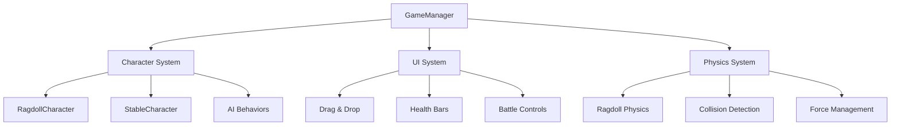

# Unity Ragdoll Game - Comprehensive Documentation

## Table of Contents
1. [Tổng quan dự án](#1-tổng-quan-dự-án)
2. [Hệ thống Character](#2-hệ-thống-character)
3. [Hệ thống Physics](#3-hệ-thống-physics)
4. [Hệ thống UI](#4-hệ-thống-ui)
5. [Game Management](#5-game-management)
6. [Rà soát Scripts và Cleanup](#6-rà-soát-scripts-và-cleanup)
7. [Troubleshooting](#7-troubleshooting)
8. [Development Roadmap](#8-development-roadmap)

---

## 1. Tổng quan dự án

### 1.1 Mô tả Game
**Unity Ragdoll Game** là một game chiến đấu 3D với cơ chế ragdoll physics, nơi người chơi có thể:
- Kéo thả characters vào map từ UI panel
- Xem các characters tự động chiến đấu với nhau
- Quan sát ragdoll physics khi characters bị tấn công hoặc chết
- Theo dõi battle progress qua UI real-time

**Target Audience:** Casual gamers thích physics-based combat và simulation games

**Core Gameplay Loop:**
1. Character Selection → Drag & Drop vào map
2. Start Battle → Characters tự động combat
3. Observe Physics → Ragdoll reactions và death animations
4. Battle End → Reset và repeat

### 1.2 Kiến trúc tổng thể



**Core Systems:**
- **GameManager**: Singleton quản lý battle state và character registration
- **Character System**: AI behaviors, combat mechanics, ragdoll physics
- **UI System**: Drag & drop, health bars, battle controls
- **Physics System**: Ragdoll mechanics, collision detection, force management

### 1.3 Unity Version và Dependencies

**Unity Version:** 2022.3 LTS+
**Render Pipeline:** URP (Universal Render Pipeline)

**Key Dependencies:**
```json
{
  "com.unity.inputsystem": "1.14.0",
  "com.unity.ai.navigation": "2.0.7",
  "com.unity.render-pipelines.universal": "17.2.0",
  "com.unity.ugui": "2.0.0"
}
```

---

## 2. Hệ thống Character

### 2.1 RagdollCharacter.cs - Core Character Implementation

**Mục đích:** Character chính với đầy đủ ragdoll physics và AI combat

**Key Properties:**
```csharp
[Header("Character Stats")]
public float maxHealth = 100f;
public float moveSpeed = 3f;
public float attackDamage = 20f;
public float attackRange = 2f;
public float attackCooldown = 1f;

[Header("Team")]
public int teamId = 1; // 1 = Blue Team, 2 = Red Team
```

**Core Components:**
- `Animator` - Animation control
- `Rigidbody` - Main physics body (kinematic during normal movement)
- `Collider` - Main collision detection
- `Rigidbody[]` - Ragdoll body parts
- `Collider[]` - Ragdoll collision parts

**Key Methods:**

#### Setup và Initialization
```csharp
void Start()
{
    // Initialize health và components
    health = maxHealth;
    animator = GetComponent<Animator>();
    mainRigidbody = GetComponent<Rigidbody>();
    
    // Setup ragdoll với delay để tránh null reference
    SetupRagdoll();
    SetupHealthBar();
}

System.Collections.IEnumerator SetupRagdollDelayed()
{
    yield return null; // Wait one frame
    
    // Get all ragdoll components
    ragdollRigidbodies = GetComponentsInChildren<Rigidbody>();
    ragdollColliders = GetComponentsInChildren<Collider>();
    
    // Disable ragdoll initially với safety checks
    foreach (Rigidbody rb in ragdollRigidbodies)
    {
        if (rb != mainRigidbody && rb != null)
        {
            rb.isKinematic = true;
            rb.useGravity = false;
            rb.linearDamping = 5f;
            rb.angularDamping = 10f;
        }
    }
    
    // Call reset after setup complete
    ResetCharacter();
}
```

#### Combat System
```csharp
void FindNearestEnemy()
{
    target = null;
    float nearestDistance = float.MaxValue;
    
    RagdollCharacter[] allCharacters = FindObjectsOfType<RagdollCharacter>();
    
    foreach (RagdollCharacter character in allCharacters)
    {
        if (character != this && character.teamId != teamId && !character.isDead)
        {
            float distance = Vector3.Distance(transform.position, character.transform.position);
            if (distance < nearestDistance)
            {
                nearestDistance = distance;
                target = character.transform;
            }
        }
    }
}

void Attack()
{
    if (target == null) return;
    
    // Trigger animation
    if (animator != null)
    {
        animator.SetTrigger("Attack");
    }
    
    // Apply damage
    RagdollCharacter targetCharacter = target.GetComponent<RagdollCharacter>();
    if (targetCharacter != null)
    {
        targetCharacter.TakeDamage(attackDamage);
    }
}
```

#### Ragdoll Physics Management
```csharp
void EnableRagdoll()
{
    isRagdoll = true;
    
    // Disable animator và main physics
    if (animator != null) animator.enabled = false;
    if (mainRigidbody != null) mainRigidbody.isKinematic = true;
    if (mainCollider != null) mainCollider.enabled = false;
    
    // Enable ragdoll parts với careful setup
    if (ragdollRigidbodies != null)
    {
        foreach (Rigidbody rb in ragdollRigidbodies)
        {
            if (rb != null && rb != mainRigidbody)
            {
                rb.linearVelocity = Vector3.zero;
                rb.angularVelocity = Vector3.zero;
                rb.isKinematic = false;
                rb.useGravity = true;
                rb.mass = 0.5f; // Lighter mass
                rb.linearDamping = 5f; // Higher damping
                rb.angularDamping = 10f;
                
                // Velocity limits để prevent flying
                rb.maxLinearVelocity = 5f;
                rb.maxAngularVelocity = 5f;
            }
        }
    }
}

void DisableRagdoll()
{
    isRagdoll = false;
    
    // Re-enable animator và main physics
    if (animator != null) animator.enabled = true;
    if (mainRigidbody != null) mainRigidbody.isKinematic = true;
    if (mainCollider != null) mainCollider.enabled = true;
    
    // Disable ragdoll parts với null checks
    if (ragdollRigidbodies != null)
    {
        foreach (Rigidbody rb in ragdollRigidbodies)
        {
            if (rb != null && rb != mainRigidbody)
            {
                rb.linearVelocity = Vector3.zero;
                rb.angularVelocity = Vector3.zero;
                rb.isKinematic = true;
                rb.useGravity = false;
            }
        }
    }
}
```

### 2.2 StableCharacter.cs - Simplified Character

**Mục đích:** Character đơn giản hóa không có ragdoll physics, dùng cho testing và fallback

**Key Differences từ RagdollCharacter:**
- Không có ragdoll physics system
- Transform-based movement thay vì physics-based
- Đơn giản hóa death handling
- Forced ground clamping (y = 0.1f)

**Use Cases:**
- Testing gameplay mechanics mà không cần physics complexity
- Fallback option khi ragdoll system có vấn đề
- Performance testing với simplified characters

### 2.3 AI Behaviors

**Movement System:**
- **Target-based movement**: Di chuyển về phía enemy gần nhất
- **Random movement**: Khi không có target, di chuyển random
- **Ground clamping**: Luôn giữ character trên mặt đất
- **Boundary checking**: Giới hạn movement trong map bounds

**Combat Logic:**
- **Enemy detection**: Scan tất cả characters, filter theo teamId
- **Attack range checking**: Chỉ attack khi trong range
- **Cooldown management**: Prevent spam attacks
- **Animation integration**: Sync attacks với animation triggers

**Team System:**
- **Team 1 (Blue)**: teamId = 1
- **Team 2 (Red)**: teamId = 2
- **Enemy detection**: Characters chỉ attack khác team
- **Visual identification**: Materials khác nhau cho mỗi team

---

## 3. Hệ thống Physics

### 3.1 Ragdoll Mechanics

**Setup Workflow:**
1. **Unity Ragdoll Wizard**: Tạo initial ragdoll setup với joints và colliders
2. **Script Configuration**: RagdollCharacter.cs quản lý enable/disable states
3. **Physics Tuning**: Mass, damping, velocity limits để prevent instability

**Enable/Disable Workflow:**
```
Normal State:
├── Main Rigidbody: Kinematic (controlled movement)
├── Main Collider: Enabled (collision detection)
├── Animator: Enabled (animations)
└── Ragdoll Parts: Kinematic + Disabled colliders

Ragdoll State:
├── Main Rigidbody: Kinematic (disabled)
├── Main Collider: Disabled
├── Animator: Disabled
└── Ragdoll Parts: Physics enabled + Active colliders
```

### 3.2 Collision Detection và Layer Configuration

**Layer Setup:**
- **Default (0)**: Characters và general objects
- **Ground (8)**: Ground plane và obstacles
- **UI (5)**: UI elements

**Physics Materials:**
- **Character Material**: Low friction, medium bounce
- **Ground Material**: High friction, no bounce

### 3.3 Các vấn đề Physics đã giải quyết

#### Problem 1: Objects bay lên trời khi Start Battle
**Root Cause:** Script `RagdollSetup.cs` tự động setup ragdoll physics và conflict với Unity Ragdoll Wizard

**Solution:**
- Xóa `RagdollSetup.cs` script
- Xóa các script workaround: `FixRagdollPhysics.cs`, `FixCharacterPhysics.cs`
- Sử dụng Unity Ragdoll Wizard setup thuần túy

#### Problem 2: NullReferenceException trong DisableRagdoll()
**Root Cause:** Timing issue - `ResetCharacter()` được gọi trước khi ragdoll arrays được setup

**Solution:**
```csharp
// Before: ResetCharacter() called immediately in Start()
void Start()
{
    SetupRagdoll();
    ResetCharacter(); // ❌ Called too early
}

// After: ResetCharacter() called after setup complete
System.Collections.IEnumerator SetupRagdollDelayed()
{
    yield return null; // Wait one frame
    // ... setup ragdoll arrays ...
    ResetCharacter(); // ✅ Called after setup
}
```

**Additional Safety Measures:**
- Null checks trong tất cả ragdoll operations
- Comprehensive error handling
- Force reset method cho debugging

### 3.4 Best Practices cho Ragdoll Configuration

**Physics Settings:**
```csharp
// Optimal ragdoll rigidbody settings
rb.mass = 0.5f;           // Lighter mass = less instability
rb.linearDamping = 5f;    // Higher damping = less bouncing
rb.angularDamping = 10f;  // Prevent excessive spinning
rb.maxLinearVelocity = 5f;  // Velocity limits
rb.maxAngularVelocity = 5f;
```

**Joint Configuration:**
- **Swing limits**: 30° để prevent unrealistic bending
- **Twist limits**: ±20° cho natural rotation
- **Spring settings**: Moderate stiffness để balance realism và stability

**Collision Setup:**
- **Collider sizing**: Slightly smaller than visual mesh để prevent interpenetration
- **Layer separation**: Proper layer masks để avoid unwanted collisions
- **Material assignment**: Consistent physics materials across all parts

---

## 4. Hệ thống UI

### 4.1 Game UI Components

**SetupGameUI.cs** - Tạo dynamic UI system:

```csharp
public static void Execute()
{
    // Create main canvas với proper scaling
    GameObject canvasGO = new GameObject("GameCanvas");
    Canvas canvas = canvasGO.AddComponent<Canvas>();
    canvas.renderMode = RenderMode.ScreenSpaceOverlay;
    canvas.sortingOrder = 100;

    // Add CanvasScaler cho responsive design
    CanvasScaler scaler = canvasGO.AddComponent<CanvasScaler>();
    scaler.uiScaleMode = CanvasScaler.ScaleMode.ScaleWithScreenSize;
    scaler.referenceResolution = new Vector2(1920, 1080);
}
```

**UI Components:**
- **Team Counters**: Real-time display của alive characters per team
- **Battle Status**: Current battle state (Setup/In Progress/Victory)
- **Start/Reset Buttons**: Battle control với proper event handling
- **Health Bars**: World-space health indicators cho mỗi character

### 4.2 Drag & Drop Functionality

**CharacterDragDrop.cs** - Core drag & drop implementation:

**Workflow:**
1. **OnMouseDown**: Detect click trên character, calculate drag offset
2. **OnMouseDrag**: Update character position theo mouse, validate drop zones
3. **OnMouseUp**: Finalize placement, snap to ground

```csharp
void OnMouseDrag()
{
    if (!isDragging || mainCamera == null) return;

    Vector3 mouseWorldPos = GetMouseWorldPosition();
    Vector3 targetPosition = mouseWorldPos + dragOffset;

    // Raycast để tìm ground position
    Vector3 groundPosition = FindGroundPosition(targetPosition);

    if (groundPosition != Vector3.zero)
    {
        // Valid drop zone
        transform.position = groundPosition + Vector3.up * groundOffset;
        SetMaterialFeedback(true);
    }
    else
    {
        // Invalid drop zone
        SetMaterialFeedback(false);
    }
}
```

**Visual Feedback System:**
- **Valid Drop Material**: Green tint khi có thể drop
- **Invalid Drop Material**: Red tint khi không thể drop
- **Ground Detection**: Raycast system để detect valid surfaces

### 4.3 UI Event Handling và Input System Integration

**Input System Setup:**
- **Mouse Input**: Primary interaction method cho drag & drop
- **Keyboard Shortcuts**: F key cho force stabilize, E key cho emergency stop
- **Touch Support**: Potential future expansion cho mobile

**Event Flow:**
```
User Input → UI Event → Game Logic → Visual Feedback
    ↓           ↓           ↓            ↓
Mouse Click → OnMouseDown → StartDrag → Material Change
Mouse Move  → OnMouseDrag → UpdatePos → Position Update
Mouse Up    → OnMouseUp   → EndDrag   → Final Placement
```

---

## 5. Game Management

### 5.1 GameManager.cs - Singleton Pattern

**Core Responsibilities:**
- Battle state management (Setup → In Progress → Victory → Reset)
- Character registration và tracking
- UI updates và event handling
- Victory condition checking

**Singleton Implementation:**
```csharp
public class GameManager : MonoBehaviour
{
    public static GameManager? Instance { get; private set; }

    void Awake()
    {
        if (Instance != null && Instance != this)
        {
            Destroy(gameObject);
            return;
        }
        Instance = this;
        DontDestroyOnLoad(gameObject);
    }
}
```

**Data Structures:**
```csharp
// Team-based character tracking
private Dictionary<int, List<RagdollCharacter>> teamCharacters;

// All alive characters for quick access
private List<RagdollCharacter> aliveCharacters;

// Battle state flag
private bool battleInProgress = false;
```

### 5.2 Battle Flow Management

**Battle States:**

#### Setup Phase
- Characters có thể được drag & drop
- Start button enabled
- No combat activity

#### In Progress Phase
```csharp
public void StartBattle()
{
    if (battleInProgress) return;

    battleInProgress = true;

    // Register all existing characters
    RagdollCharacter[] allCharacters = Object.FindObjectsByType<RagdollCharacter>();
    foreach (var character in allCharacters)
    {
        RegisterCharacter(character);
    }

    // Update UI state
    if (gameStatusText != null)
        gameStatusText.text = "BATTLE IN PROGRESS!";

    if (startBattleButton != null)
        startBattleButton.interactable = false;
}
```

#### Victory/Reset Phase
- Detect team elimination
- Display victory message
- Enable reset functionality

### 5.3 Character Registration và Death Handling

**Registration System:**
```csharp
public void RegisterCharacter(RagdollCharacter character)
{
    if (character == null || !battleInProgress) return;

    // Add to team tracking
    if (!teamCharacters.ContainsKey(character.GetTeamId()))
    {
        teamCharacters[character.GetTeamId()] = new List<RagdollCharacter>();
    }
    teamCharacters[character.GetTeamId()].Add(character);

    // Add to alive list
    aliveCharacters.Add(character);

    UpdateUI();
}
```

**Death Handling:**
```csharp
public void OnCharacterDied(RagdollCharacter character)
{
    if (character == null) return;

    // Remove from alive list
    aliveCharacters.Remove(character);

    // Check victory conditions
    CheckGameStatus();
    UpdateUI();
}
```

**Victory Detection:**
```csharp
private void CheckGameStatus()
{
    var aliveTeams = new HashSet<int>();
    foreach (var character in aliveCharacters)
    {
        aliveTeams.Add(character.GetTeamId());
    }

    if (aliveTeams.Count <= 1)
    {
        // Battle ended
        EndBattle(aliveTeams.FirstOrDefault());
    }
}
```

---

## 6. Rà soát Scripts và Cleanup

### 6.1 Scripts Classification Table

| Script Name | Category | Status | Priority | Purpose |
|-------------|----------|--------|----------|---------|
| **Core Production Scripts** |
| `GameManager.cs` | Core | ✅ Active | High | Battle state management |
| `RagdollCharacter.cs` | Core | ✅ Active | High | Main character implementation |
| `SetupGameUI.cs` | Core | ✅ Active | High | UI system setup |
| `CharacterDragDrop.cs` | Core | ✅ Active | High | Drag & drop functionality |
| **Utility Scripts** |
| `StableCharacter.cs` | Utility | ✅ Active | Medium | Testing/fallback character |
| `ICharacter.cs` | Interface | ✅ Active | Medium | Character contract definition |
| **Debug/Testing Scripts** |
| `DebugCharacterDifferences.cs` | Debug | ✅ Active | Low | Character analysis tool |
| `ForceStabilizeCharacters.cs` | Debug | ✅ Active | Low | Physics debugging tool |
| **Health Bar Management** |
| `FixHealthBars.cs` | Utility | ✅ Active | Medium | Health bar setup |
| `FixHealthBarsProperSize.cs` | Utility | ⚠️ Redundant | Low | Health bar sizing |
| `FixHealthBarsTiny.cs` | Utility | ⚠️ Redundant | Low | Health bar sizing variant |
| `FixHealthBarsUltraTiny.cs` | Utility | ⚠️ Redundant | Low | Health bar sizing variant |
| **Animation System** |
| `CreateAnimations.cs` | Utility | ✅ Active | Medium | Animation setup tool |
| `SetupAnimatorController.cs` | Utility | ✅ Active | Medium | Animator configuration |
| **Material/Setup Scripts** |
| `AssignDragDropMaterials.cs` | Setup | ✅ Active | Medium | Material assignment |
| `SetupDragDropSystem.cs` | Setup | ✅ Active | Medium | Drag & drop system setup |
| **Deprecated/Removed Scripts** |
| `RagdollSetup.cs` | Deprecated | ❌ Removed | N/A | Caused physics conflicts |
| `FixRagdollPhysics.cs` | Deprecated | ❌ Removed | N/A | Workaround script |
| `FixCharacterPhysics.cs` | Deprecated | ❌ Removed | N/A | Workaround script |
| `SimpleRagdollCharacter.cs` | Deprecated | ❌ Removed | N/A | Redundant variant |
| `ProperRagdollCharacter.cs` | Deprecated | ❌ Removed | N/A | Redundant variant |
| `PhysicsTestHelper.cs` | Deprecated | ❌ Removed | N/A | Debug utility |

### 6.2 Scripts cần thiết (Production Ready)

**Core Scripts (Cannot be removed):**
- ✅ `GameManager.cs` - Central game state management
- ✅ `RagdollCharacter.cs` - Main character implementation
- ✅ `SetupGameUI.cs` - UI system creation
- ✅ `CharacterDragDrop.cs` - Drag & drop functionality
- ✅ `ICharacter.cs` - Interface definition

**Supporting Scripts (Important for functionality):**
- ✅ `StableCharacter.cs` - Fallback character implementation
- ✅ `FixHealthBars.cs` - Health bar management
- ✅ `CreateAnimations.cs` - Animation system setup
- ✅ `SetupAnimatorController.cs` - Animator configuration
- ✅ `AssignDragDropMaterials.cs` - Material assignment
- ✅ `SetupDragDropSystem.cs` - System initialization

### 6.3 Scripts Test/Debug (Safe to remove in production)

**Debug Tools:**
- 🔧 `DebugCharacterDifferences.cs` - Character analysis (keep for debugging)
- 🔧 `ForceStabilizeCharacters.cs` - Physics debugging (keep for emergency fixes)
- 🔧 `ShowHealthBarsInSceneView.cs` - Scene view utilities

**Testing Scripts:**
- ⚠️ `MakeHealthBarsVisibleInScene.cs` - Scene view testing
- ⚠️ Various health bar size variants - Can be consolidated

### 6.4 Scripts Deprecated (Already removed)

**Successfully Removed (Caused conflicts):**
- ❌ `RagdollSetup.cs` - Conflicted with Unity Ragdoll Wizard
- ❌ `FixRagdollPhysics.cs` - Workaround for removed script
- ❌ `FixCharacterPhysics.cs` - Workaround for removed script
- ❌ `SimpleRagdollCharacter.cs` - Redundant character variant
- ❌ `ProperRagdollCharacter.cs` - Redundant character variant
- ❌ `PhysicsTestHelper.cs` - Debug utility no longer needed

### 6.5 Cleanup Recommendations

#### High Priority Cleanup Tasks
- [ ] **Consolidate Health Bar Scripts**: Merge multiple health bar sizing scripts into one configurable script
- [ ] **Remove Redundant Setup Scripts**: Identify và remove duplicate setup functionality
- [ ] **Organize Debug Scripts**: Move debug scripts to separate folder structure

#### Medium Priority Cleanup Tasks
- [ ] **Script Documentation**: Add comprehensive XML documentation to all core scripts
- [ ] **Code Refactoring**: Extract common functionality into utility classes
- [ ] **Performance Optimization**: Review và optimize frequently called methods

#### Low Priority Cleanup Tasks
- [ ] **Naming Convention**: Standardize script naming conventions
- [ ] **Folder Organization**: Reorganize scripts into logical folder structure
- [ ] **Unused Using Statements**: Remove unused imports across all scripts

---

## 7. Troubleshooting

### 7.1 Common Issues và Solutions

#### Issue: Objects bay lên trời khi Start Battle
**Symptoms:** Characters fly upward uncontrollably when battle starts
**Root Cause:** Physics conflicts từ multiple ragdoll setup scripts
**Solution:**
```bash
# Verify these scripts are removed:
- RagdollSetup.cs ❌
- FixRagdollPhysics.cs ❌
- FixCharacterPhysics.cs ❌
```
**Prevention:** Only use Unity Ragdoll Wizard for ragdoll setup

#### Issue: NullReferenceException trong RagdollCharacter
**Symptoms:** Console errors về null ragdoll arrays
**Root Cause:** Timing issue - methods called before setup complete
**Solution:**
```csharp
// Use ForceStabilizeCharacters.cs emergency fix
ForceStabilizeCharacters.Execute();

// Or press F key during gameplay
```

#### Issue: Characters không respond to drag & drop
**Symptoms:** Cannot drag characters to map
**Root Cause:** Missing colliders hoặc incorrect layer setup
**Solution:**
```csharp
// Run setup scripts in order:
1. SetupDragDropSystem.Execute();
2. AssignDragDropMaterials.Execute();
```

#### Issue: UI buttons không hoạt động
**Symptoms:** Start/Reset buttons không respond
**Root Cause:** Missing EventSystem hoặc UI setup incomplete
**Solution:**
```csharp
// Re-run UI setup:
SetupGameUI.Execute();
```

### 7.2 Debug Tools

#### ForceStabilizeCharacters.cs
**Purpose:** Emergency physics stabilization
**Usage:**
- Attach to any GameObject
- Right-click → "Force Stabilize All Characters"
- Or press F key during gameplay
- Press E for emergency physics stop

#### DebugCharacterDifferences.cs
**Purpose:** Analyze character configuration differences
**Usage:**
- Attach to any GameObject
- Right-click → "Analyze Character Differences"
- Check Console for detailed analysis

### 7.3 Performance Monitoring

**Key Metrics to Watch:**
- **Physics Update Time**: Should be < 2ms
- **Character Count**: Optimal range 10-20 characters
- **Ragdoll Active Count**: Minimize simultaneous active ragdolls
- **UI Update Frequency**: Health bars update only when needed

**Performance Optimization Tips:**
```csharp
// Limit ragdoll physics updates
rb.maxLinearVelocity = 5f;
rb.maxAngularVelocity = 5f;

// Use object pooling for characters
// Batch UI updates instead of per-frame
// Disable ragdoll colliders when not needed
```

---

## 8. Development Roadmap

### 8.1 Immediate Priorities (Week 1-2)

#### Critical Fixes
- [ ] **Consolidate Health Bar Scripts** - Merge redundant sizing variants
- [ ] **Optimize Character AI** - Reduce FindObjectsOfType calls
- [ ] **Improve Drag & Drop Feedback** - Better visual indicators
- [ ] **Add Input Validation** - Prevent invalid character placements

#### Code Quality
- [ ] **Add XML Documentation** - Document all public methods
- [ ] **Implement Error Handling** - Graceful degradation for edge cases
- [ ] **Unit Testing Setup** - Basic test framework for core systems
- [ ] **Code Review** - Standardize coding conventions

### 8.2 Short-term Goals (Month 1)

#### Feature Enhancements
- [ ] **Character Customization** - Different character types/stats
- [ ] **Map Variations** - Multiple battle arenas
- [ ] **Sound System** - Audio feedback for actions
- [ ] **Particle Effects** - Visual impact for attacks/deaths

#### Technical Improvements
- [ ] **Object Pooling** - Efficient character management
- [ ] **Save System** - Persist game state
- [ ] **Settings Menu** - Configurable game options
- [ ] **Performance Profiling** - Identify bottlenecks

### 8.3 Medium-term Vision (Month 2-3)

#### Gameplay Features
- [ ] **Campaign Mode** - Progressive difficulty levels
- [ ] **Character Progression** - Upgradeable stats
- [ ] **Special Abilities** - Unique character powers
- [ ] **Tournament Mode** - Bracket-style competitions

#### Technical Architecture
- [ ] **Modular System Design** - Plugin-based architecture
- [ ] **Network Foundation** - Prepare for multiplayer
- [ ] **Asset Streaming** - Dynamic content loading
- [ ] **Platform Optimization** - Mobile/console preparation

### 8.4 Long-term Roadmap (Month 4+)

#### Advanced Features
- [ ] **Multiplayer Support** - Online battles
- [ ] **Level Editor** - User-generated content
- [ ] **Replay System** - Record và playback battles
- [ ] **Spectator Mode** - Watch battles without participating

#### Platform Expansion
- [ ] **Mobile Port** - Touch-optimized controls
- [ ] **Console Support** - Controller integration
- [ ] **VR Experiment** - Immersive battle viewing
- [ ] **Web Build** - Browser-based version

### 8.5 Cleanup Priority Matrix

| Task | Impact | Effort | Priority |
|------|--------|--------|----------|
| Consolidate Health Bar Scripts | High | Low | 🔴 Critical |
| Remove Debug Scripts | Medium | Low | 🟡 High |
| Optimize AI Performance | High | Medium | 🟡 High |
| Add Documentation | Medium | Medium | 🟢 Medium |
| Reorganize Folder Structure | Low | Low | 🟢 Medium |
| Implement Unit Tests | High | High | 🔵 Low |

### 8.6 Success Metrics

#### Technical KPIs
- **Build Time**: < 30 seconds
- **Frame Rate**: Stable 60 FPS với 20 characters
- **Memory Usage**: < 500MB peak
- **Load Time**: < 5 seconds scene transition

#### Quality Metrics
- **Bug Reports**: < 1 per week
- **Code Coverage**: > 80% for core systems
- **Documentation**: 100% public API documented
- **Performance**: No frame drops during peak action

---

## Conclusion

Dự án Unity Ragdoll Game đã đạt được trạng thái ổn định với core functionality hoàn chỉnh. Các vấn đề physics chính đã được giải quyết, và hệ thống có thể mở rộng cho future development.

**Key Achievements:**
- ✅ Stable ragdoll physics system
- ✅ Functional drag & drop mechanics
- ✅ Complete battle management system
- ✅ Comprehensive debugging tools
- ✅ Clean codebase với removed conflicts

**Next Steps:**
1. Execute immediate cleanup tasks
2. Implement performance optimizations
3. Add comprehensive testing
4. Plan feature expansions

**Maintenance Notes:**
- Regular performance monitoring required
- Keep debug tools available for troubleshooting
- Document any new physics-related changes carefully
- Test thoroughly before removing any "utility" scripts

---

*Document Version: 1.0*
*Last Updated: July 2024*
*Maintained by: Development Team*
